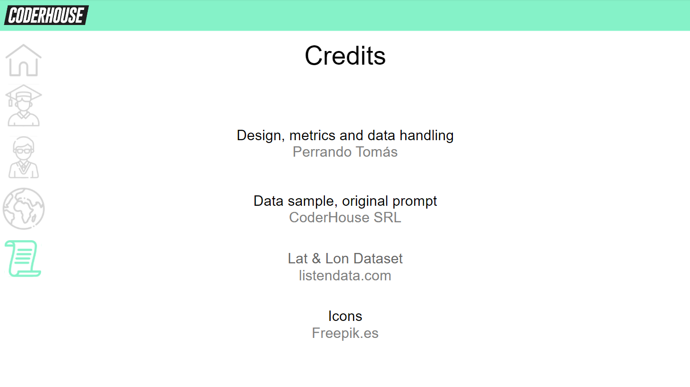

# CoderHouse Staff & Alumni analysis
So... this was originally part of a **workshop**, CoderHouse gave us a sample of their own database and asked us to analyze the data with a couple of prompts. More than limiting myself to what they asked for, I saw this as an opportuny to explore **PowerBI** as a tool and refine my **Storytelling** skills (I was pretty excited about it after reading *Storytelling With Data* from Cole Nussbaumer).

I've created far more Metrics and KPI's than what they asked for, and I even ended up crossing data from outer sources with the original database to make a pretty good looking **map**! 

I hope this give you an idea of what kind of visualizations you could expect from me :)

Warning! - The visuals are in Spanish

##Tl;dr

- Created a *PowerBI* report using a sample database of their own that the company gave us
- Got pretty nice visuals and *storytelling*
- Used *MSSQLS* and *Excel* to integrate new data from outer sources and create a very cool looking map - Sharpening those *problem solving* skills!

## General Structure
Brand colors and icons were used to represent a for-and-from CoderHouse report. A simple but effective distribution of four light colored visual graphs on the center-right alongside selection indicators on the left and dark filters on the same column was used for an aesthetically pleasing report with no visual clutter (seriously, it was too much bright until I came up with the idea of the dark filters). Navigation icons were selected according to the aesthetic and thematic of the project.

## Students tab
We were asked to analyze the amount of students open by different segments - Area, resgister month, daytime, etc. Four slots weren't enough, so I've overlapped two similar graphs together and added a bookmark selector to switch between them.
The bottom-left one was an idea of mine. it shows the amount of new students over time and compared it to the previous year. It was inspired on a CHURN graphic, I know it isn't the same, but I didn't enough data to perform one.

## Staff
As you may notice now, since the very first page the report assigns the sea green color to the students, and a bland blue to the staff. This page is made out of three graphs and a detail table, I must say, I'm not a fan of detail tables in the middle of a report, but we were asked for it.

## Map
And here It's where the fun begins - I had data about the location of the students in the database, but they were ZIP codes. That gave me two problems: First, It turns out that ZIP codes aren't unique; they can be shared across countries (I didn't know that lol), so PowerBI takes the data and places It with some sort of random order priority, It was a mess! And as a second problem, even if the ZIP codes were unique to each country, that would give me a map with a bubble in each Zip code, insead of the whole country, I had to do something about It!

So after doing some research, I've found [this page](https://www.listendata.com/2020/11/zip-code-to-latitude-and-longitude.html) that offers a dataset of ZIP codes converted to latitude and longitude, that was my golden egg chicken.
The codes were split between continents, and like I've said, there was a lot of repeated codes.
I wanted to union every table into a single, big table, but get rid of the duplicates in the process, so I've stablished a priority for each continent based on the location of the company and I'ts staff, this way, each code will indicate the country that is most likely to have an student on it.

The priority were SA>NA>EU>OC>AS>AF (based on the location of the company, and then the number of spanish speakers).

I unionized the tables with a couple of SQL queries, using a mark to order them by my custom priority, and then removed the duplicates in Excel.

   

  

     -- Some data standarizing because the data types varied between tables
    
    ALTER TABLE LatitudesSA
    ALTER COLUMN [postal code] varchar(255)
    
    ALTER TABLE LatitudesAF
    ALTER COLUMN [postal code] varchar(255)
    
    ALTER TABLE LatitudesOC
    ALTER COLUMN [postal code] varchar(255)
    
    --Actual union query:
    
    SELECT DISTINCT [codigo postal],
                             Latitude,
    						 Longitude,
    						 State,
    						 country,
    						 Continent, 
    						 1 AS "Order" -- Mark to be able to give custom order to the resulting table
             FROM   estudiantes
                    LEFT JOIN latitudesSA -- South America coordenates first since CoderHouse is an Argentine company.
                           ON estudiantes.[codigo postal] =
                              [postal code] WHERE Country IS NOT NULL
    
    						  
    UNION
    
    SELECT DISTINCT [codigo postal],
                             Latitude,
    						 Longitude,
    						 State,
                             country,
    						 Continent, 
    						 2
             FROM   estudiantes
                    LEFT JOIN latitudesNA -- North America coordenates - since there, continents were ordered by amount of spanish speaking people.
                           ON estudiantes.[codigo postal] =
                              [postal code] WHERE Country IS NOT NULL
    
    UNION
    
    SELECT DISTINCT [codigo postal],
                             Latitude,
    						 Longitude,
    						 State,
                             country,
    						 Continent, 
    						 3
             FROM   estudiantes
                    LEFT JOIN latitudesEU -- Europe coordenates
                           ON estudiantes.[codigo postal] =
                              [postal code] WHERE Country IS NOT NULL
    
    UNION
    
    SELECT DISTINCT [codigo postal],
                             Latitude,
    						 Longitude,
    						 State,
                             country,
    						 Continent, 
    						 4
             FROM   estudiantes
                    LEFT JOIN latitudesOC -- Oceania coordenates
                           ON estudiantes.[codigo postal] =
                              [postal code] WHERE Country IS NOT NULL
    
    
    UNION
    
    SELECT DISTINCT [codigo postal],
                             Latitude,
    						 Longitude,
    						 State,
                             country,
    						 Continent, 
    						 5
             FROM   estudiantes
                    LEFT JOIN latitudesAS -- Asia coordenates
                           ON estudiantes.[codigo postal] =
                              [postal code] WHERE Country IS NOT NULL
    
    UNION
    
    SELECT DISTINCT [codigo postal],
                             Latitude,
    						 Longitude,
    						 State,
                             country,
    						 Continent, 
    						 6
             FROM   estudiantes
                    LEFT JOIN latitudesAF -- Africa coordenates
                           ON estudiantes.[codigo postal] =
                              [postal code]
    WHERE Country IS NOT NULL
    ORDER BY "order" 

And finally, here's the result!

Notice that I used the same green that students had before. Visual cohesion is important!

## Credits
Always give credits to you contributors, specially the ones who ask for it!

